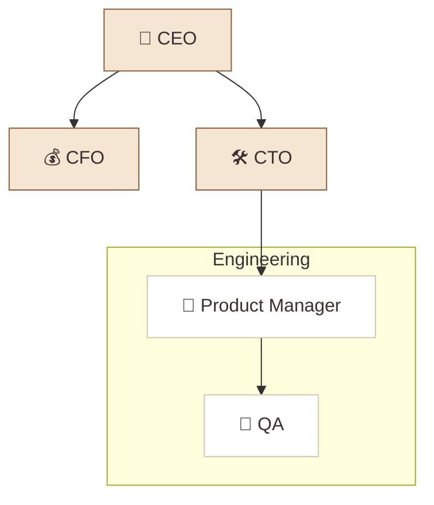

# How to Write a Cabinet

A complete protocol specification for creating, structuring, and publishing Cabinet templates.

---

## Table of Contents

1. [What is a Cabinet?](#1-what-is-a-cabinet)
2. [Required Structure](#2-required-structure)
3. [The `.cabinet` Identity File](#3-the-cabinet-identity-file)
4. [The `index.md` Entry Point](#4-the-indexmd-entry-point)
5. [Agent Personas (`.agents/`)](#5-agent-personas-agents)
6. [Scheduled Jobs (`.jobs/`)](#6-scheduled-jobs-jobs)
7. [Content Pages](#7-content-pages)
8. [Supported File Types](#8-supported-file-types)
9. [Embedded Webapps](#9-embedded-webapps)
10. [Child Cabinets](#10-child-cabinets)
11. [Org Charts](#11-org-charts)
12. [Naming Conventions](#12-naming-conventions)
13. [Complete Example: Minimal Cabinet](#13-complete-example-minimal-cabinet)
14. [Complete Example: Multi-Child Cabinet](#14-complete-example-multi-child-cabinet)
15. [Checklist Before Publishing](#15-checklist-before-publishing)

---

## 1. What is a Cabinet?

A cabinet is a **directory on disk** that contains everything an AI team needs to operate: agents, scheduled jobs, and a knowledge base. It is self-contained, versionable, and portable.

```
my-cabinet/
  .cabinet              ← identity & metadata (YAML, no extension)
  .cabinet-state/       ← runtime state (never commit content here)
    .gitkeep
  .agents/              ← AI team members
    agent-slug/
      persona.md
  .jobs/                ← scheduled automations
    job-id.yaml
  index.md              ← entry point page
  section/              ← content subdirectory
    index.md
```

**Core rules:**
- A cabinet is just a directory. Copy it, version it, share it — it works anywhere.
- Hidden directories (`.cabinet`, `.cabinet-state`, `.agents`, `.jobs`) are invisible in the UI.
- Every directory that has agents or jobs is a cabinet and must have a `.cabinet` file.
- Content lives as plain markdown, CSV, images, and HTML — never in a database.

---

## 2. Required Structure

Every cabinet — root or child — must have exactly these four items:

| Item | Purpose | Required? |
|---|---|---|
| `.cabinet` | Identity and metadata | **Yes — always** |
| `.cabinet-state/.gitkeep` | Runtime state placeholder | **Yes — always** |
| `.agents/` | Agent persona definitions | Yes if the cabinet has agents |
| `.jobs/` | Scheduled job definitions | Yes if the cabinet has jobs |
| `index.md` | Entry point page | **Yes — always** |

A cabinet without `.cabinet` will not be recognized by the runtime. A cabinet without `.cabinet-state/.gitkeep` will fail on first agent execution.

---

## 3. The `.cabinet` Identity File

The `.cabinet` file is YAML with **no file extension**. It lives at the root of every cabinet directory.

### Root cabinet

```yaml
schemaVersion: 1
id: my-cabinet-root
name: My Cabinet
kind: root
version: 0.1.0
description: >
  One or two sentences describing what this cabinet does and who it is for.
entry: index.md
```

### Child cabinet

```yaml
schemaVersion: 1
id: my-cabinet-section
name: Section Name
kind: child
version: 0.1.0
description: What this child cabinet handles within the parent.
entry: index.md

parent:
  shared_context:
    - /index.md
    - /company/strategy/index.md

access:
  mode: subtree-plus-parent-brief
```

### Field reference

| Field | Type | Description |
|---|---|---|
| `schemaVersion` | integer | Always `1` |
| `id` | string | Unique slug. Convention: `{cabinet-name}-{section}` (e.g. `text-your-mom-reddit`) |
| `name` | string | Human-readable display name |
| `kind` | string | `root` or `child` |
| `version` | string | Semantic version. Start at `0.1.0` |
| `description` | string | What this cabinet does. Used in `npx cabinets info` output |
| `entry` | string | Entry point file. Almost always `index.md` |
| `parent.shared_context` | list | Paths (relative to root cabinet) the child agents can read for context |
| `access.mode` | string | How agents read the tree. Use `subtree-plus-parent-brief` |

---

## 4. The `index.md` Entry Point

Every cabinet and content directory has an `index.md`. It is the page the user sees when they open that node in the sidebar.

### Frontmatter

```yaml
---
title: Page Title
created: '2026-04-13T00:00:00.000Z'
modified: '2026-04-13T00:00:00.000Z'
tags:
  - tag-one
  - tag-two
order: 1
icon: 🎯
---
```

| Field | Required | Notes |
|---|---|---|
| `title` | Yes | Display name in sidebar. Keep it short. |
| `created` | Yes | ISO 8601 with milliseconds and `Z` suffix |
| `modified` | Yes | ISO 8601. Update when content changes. |
| `tags` | Yes | Array. Used for search filtering. Can be empty `[]`. |
| `order` | Recommended | Integer. Lower = higher in sidebar. Omit to sort alphabetically. |
| `icon` | Optional | A single emoji. Shown next to the title in the sidebar. |

### Timestamp format

Always use the full ISO 8601 format with the `Z` suffix:

```
'2026-04-13T00:00:00.000Z'   ← correct
'2026-04-13T00:00:00Z'       ← also accepted
2026-04-13                   ← wrong — no quotes, no time
```

### Content conventions

- Use `[[Page Name]]` syntax for internal wiki-links between pages.
- Link to sub-pages: `[[section/page]]` or with display text: `[[section/page|Display Text]]`
- Assets (images, PDFs) live next to the markdown file. Reference them with relative paths: ``
- Use markdown tables for structured data — they render properly in the editor.
- Use heading levels H2 (`##`) and below inside pages. H1 (`#`) is the page title.

---

## 5. Agent Personas (`.agents/`)

Each agent is a directory under `.agents/` containing a single `persona.md` file.

```
.agents/
  ceo/
    persona.md
  analyst/
    persona.md
  deal-scout/
    persona.md
```

The directory name is the agent's **slug** — it must be lowercase, hyphenated, and match the `slug:` field in the frontmatter.

### Persona frontmatter

```yaml
---
name: Agent Display Name
slug: agent-slug
emoji: "🎯"
type: lead
department: leadership
role: One-line description of what this agent is responsible for
heartbeat: "0 9 * * 1-5"
budget: 100
active: true
workdir: /
workspace: /
channels:
  - general
  - department-channel
focus:
  - topic-one
  - topic-two
tags:
  - tag-one
  - tag-two
setupComplete: true
---
```

### Field reference

| Field | Type | Required | Notes |
|---|---|---|---|
| `name` | string | Yes | Human-readable display name (e.g. `CEO`, `Deal Scout`) |
| `slug` | string | Yes | Kebab-case. Must match the directory name. |
| `emoji` | string | Yes | Single emoji as a Unicode escape or literal: `"🎯"` or `"\U0001F3AF"` |
| `type` | string | Yes | `lead` (decision-maker) or `specialist` (executes a domain) |
| `department` | string | Yes | Logical grouping: `leadership`, `research`, `finance`, `engineering`, etc. |
| `role` | string | Yes | One sentence describing what this agent is responsible for |
| `heartbeat` | string | Yes | Cron expression (quoted). When the agent runs autonomously. |
| `budget` | integer | Yes | Token budget per execution. `100` for leads, `60–80` for specialists |
| `active` | boolean | Yes | `true` enables the heartbeat. `false` pauses it. |
| `workdir` | string | Yes | Working directory context. Almost always `/` |
| `workspace` | string | Yes | The primary content area this agent writes to (e.g. `/portfolio`, `/cv-lab`) |
| `channels` | list | Yes | Communication channels. Always include `general` |
| `focus` | list | Yes | Topic tags that define the agent's area of concern |
| `tags` | list | Yes | Search/filter tags |
| `setupComplete` | boolean | Yes | Always `true` in published templates |

### Agent types

| `type` | When to use | Typical `budget` |
|---|---|---|
| `lead` | Decision-makers, coordinators, GP/C-level equivalents | 80–100 |
| `specialist` | Domain executors with a narrow, well-defined output | 60–80 |

### Writing the persona body

Below the frontmatter, write the agent's operating instructions in markdown:

```markdown
# Agent Name

One paragraph describing the agent's identity, role, and what they care about. 
Write in second person: "You are the CEO of...". Give them a point of view.

## Responsibilities

1. Numbered list of concrete, observable responsibilities
2. Each item should be an action (Review, Write, Monitor, Flag, Produce)
3. 4–7 items is the right range — too few is vague, too many is unfocused

## Operating Context

- Where the relevant content lives in the KB
- Which pages the agent reads from and writes to
- Any key dependencies (other agents, external systems)

## Working Style

- Terse rules about tone, format, and priorities
- 3–5 bullets is the right range
- These are constraints, not suggestions
```

**Rules for good persona bodies:**
- Write in second person: "You are the..." not "The agent should..."
- Give each agent a distinct voice and point of view — they should feel like real colleagues, not tools.
- Responsibilities must be specific enough that the agent knows when it has done them.
- Never put content that belongs in a job prompt here. The persona defines character; the job defines the task.

---

## 6. Scheduled Jobs (`.jobs/`)

Each job is a YAML file under `.jobs/`. The filename is the job ID with a `.yaml` extension.

```
.jobs/
  daily-morning-brief.yaml
  weekly-partner-prep.yaml
  monthly-lp-update.yaml
```

### Job YAML format

```yaml
id: job-id-slug
name: Human-Readable Job Name
description: One sentence describing what this job produces and when.
ownerAgent: agent-slug
agentSlug: agent-slug
enabled: true
schedule: "0 9 * * 1"
provider: claude-code
timeout: 600
prompt: |-
  Full instruction text for the agent.
  Can span multiple lines.
  Be specific about what to read, what to write, and what format to use.
cabinetPath: cabinet-name
createdAt: "2026-04-13T00:00:00.000Z"
updatedAt: "2026-04-13T00:00:00.000Z"
```

### Field reference

| Field | Type | Required | Notes |
|---|---|---|---|
| `id` | string | Yes | Kebab-case slug. Must match filename (without `.yaml`). |
| `name` | string | Yes | Display name shown in the Jobs UI |
| `description` | string | Yes | One sentence: what it produces and when |
| `ownerAgent` | string | Yes | Slug of the agent that runs this job (must exist in `.agents/`) |
| `agentSlug` | string | Yes | Same value as `ownerAgent` |
| `enabled` | boolean | Yes | `true` to activate. `false` to pause without deleting. |
| `schedule` | string | Yes | Cron expression, **always quoted**: `"0 9 * * 1"` |
| `provider` | string | Yes | Always `claude-code` |
| `timeout` | integer | Yes | Max execution seconds. `600` (10 min) is standard. |
| `prompt` | string | Yes | Full task instruction. Use `|-` for multiline YAML. |
| `cabinetPath` | string | Yes | Path from data root (e.g. `vc-os`, `text-your-mom/marketing/tiktok`) |
| `createdAt` | string | Yes | ISO 8601 with `Z` suffix, quoted |
| `updatedAt` | string | Yes | ISO 8601 with `Z` suffix, quoted. Update when prompt changes. |

### Cron schedule reference

```
"0 7 * * 1-5"    → 7:00 AM, Monday–Friday
"0 9 * * 1"      → 9:00 AM, Mondays only
"0 9 * * 4"      → 9:00 AM, Thursdays only
"0 18 * * 1"     → 6:00 PM, Mondays only
"0 9 * * 5"      → 9:00 AM, Fridays only
"0 16 * * 5"     → 4:00 PM, Fridays only
"0 10 * * 1-5"   → 10:00 AM, Monday–Friday
"0 0 1 * *"      → Midnight on the 1st of each month
```

Always quote the cron expression: `"0 9 * * 1"` not `0 9 * * 1`.

### Writing good prompts

A job prompt is a task brief — the agent receives it as their complete instruction. It should:

1. **State what to read** — exact file paths or directory paths
2. **State what to produce** — specific output format, file to write to
3. **State how to append vs. overwrite** — agents must be told explicitly
4. **Include the date convention** — `[Date]` or `[YYYY-MM]` so output is organized over time
5. **Be specific about format** — table vs. bullets vs. paragraph
6. **Not repeat the persona** — the agent already knows who they are; the prompt is the task

```yaml
# Bad prompt — vague, no output target
prompt: |-
  Review the portfolio and summarize what's happening.

# Good prompt — specific reads, specific write target, specific format
prompt: |-
  Review each company's metrics.csv under portfolio/companies/.
  For each company, check the most recent month's ARR, MoM growth, and runway.
  Flag any metric that moved more than 15% in either direction.
  Append a new health check section to portfolio/index.md using this format:
  ## Weekly Health Check — [Date]
  | Company | ARR | MoM | Runway | Status |
  Then add 2–3 bullets on what needs attention, and one "Win this week" bullet.
```

---

## 7. Content Pages

Content pages are markdown files, either standalone or in directories.

### Standalone pages

```
my-cabinet/
  overview.md           ← shown in sidebar as "Overview"
  notes.md              ← shown as "Notes"
```

### Directory pages

```
my-cabinet/
  team/
    index.md            ← the "Team" page
    maya-chen.md        ← "Maya Chen" sub-page (or a sub-directory)
    rafael-osei.md
```

Use directories when a page has assets (images, PDFs) or sub-pages. Use standalone `.md` files for leaf content with no children.

### Page naming

| Convention | Example | Result in sidebar |
|---|---|---|
| Kebab-case directory | `deal-flow/` | "Deal Flow" (auto-capitalized) |
| Descriptive file names | `q1-2026-report.md` | "Q1 2026 Report" |
| `index.md` inside directory | `team/index.md` | "Team" (directory name shown) |

---

## 8. Supported File Types

Cabinet renders these file types as first-class views in the sidebar tree:

| Type | Extensions | Renders as |
|---|---|---|
| Markdown | `.md` | WYSIWYG editor |
| CSV | `.csv` | Interactive table with sort/filter |
| PDF | `.pdf` | Inline PDF viewer |
| Mermaid diagram | `.mermaid`, `.mmd` | Rendered diagram |
| Image | `.png .jpg .jpeg .gif .webp .svg .avif .ico` | Inline image viewer |
| Video | `.mp4 .webm .mov .m4v` | Inline video player |
| Audio | `.mp3 .wav .ogg .m4a .aac` | Inline audio player |
| Code | `.js .ts .py .go .swift .yaml .json` and more | Syntax-highlighted viewer |
| Embedded website | Directory with `index.html`, **no** `index.md` | Iframe (sidebar visible) |
| Full-screen app | Directory with `index.html` + `.app` marker | Full-screen iframe, sidebar hides |

Files not on this list are silently hidden from the sidebar (but still accessible to agents).

**Use CSV for any structured list data** — metrics, pipelines, calendars, inventories. It renders as an interactive table and agents can read and write it easily.

**Use Mermaid for diagrams** — org charts, flowcharts, quadrant maps. Name the file descriptively: `org-chart.mmd`, `landscape.mmd`.

---

## 9. Embedded Webapps

A directory with `index.html` and **no `index.md`** renders as an embedded website inside an iframe.

### Sidebar-visible (default)

```
sprint-board/
  index.html            ← rendered as iframe, sidebar stays visible
```

### Full-screen app

Add an empty `.app` marker file to collapse the sidebar on click:

```
events-calendar/
  index.html            ← rendered full-screen, sidebar + AI panel hide
  .app                  ← marker file (empty, no content)
```

### Critical rule: no `index.md` + `index.html` conflict

If a directory has **both** `index.md` and `index.html`, the markdown wins — the HTML is silently ignored as a website. If you want both a description page and a webapp, put the webapp in its own subdirectory:

```
# Wrong — HTML ignored because index.md exists
deal-flow/
  index.md              ← wins, HTML ignored
  index.html            ← ignored as a webapp

# Correct — separate directories
deal-flow/
  index.md              ← the description page
  pipeline-board/       ← separate directory
    index.html          ← rendered as webapp
    .app
```

### Writing webapps

- Self-contained HTML. Use CDN links for libraries (Chart.js, etc.).
- Match the Cabinet dark theme: `background: #0d0d10`, `color: #e8e8f0`, accents at `#7c5cfc`.
- All data hardcoded — agents cannot inject data into HTML at runtime.
- Use the webapp for **visualization and interaction**; use markdown+CSV for **agent-editable data**.

---

## 10. Child Cabinets

A child cabinet is a subdirectory that has its own `.cabinet` file, agents, and jobs. It represents a distinct team or function within the parent.

### When to make a subdirectory a child cabinet

Make a subdirectory a child cabinet when it has **any of**:
- Its own agent personas (`.agents/`)
- Its own scheduled jobs (`.jobs/`)
- A distinct team with a clear scope boundary

Subdirectories that are just content (a folder of pages with no agents or jobs) do not need a `.cabinet` file.

### Child cabinet structure

```
my-cabinet/
  .cabinet              ← root cabinet identity
  .cabinet-state/
    .gitkeep
  .agents/
  .jobs/
  index.md
  
  child-section/        ← child cabinet
    .cabinet            ← child identity (kind: child)
    .cabinet-state/
      .gitkeep
    .agents/
      agent-slug/
        persona.md
    .jobs/
      job.yaml
    index.md
    content/
      index.md
```

### Child `.cabinet` fields

```yaml
schemaVersion: 1
id: parent-child-section
name: Section Name
kind: child
version: 0.1.0
description: What this child handles.
entry: index.md

parent:
  shared_context:
    - /index.md
    - /company/strategy/index.md

access:
  mode: subtree-plus-parent-brief
```

`parent.shared_context` is a list of paths (relative to the **root** cabinet) that child agents can read for context. Choose pages that give child agents the strategic context they need without flooding them with the entire parent tree.

`access.mode: subtree-plus-parent-brief` is the standard value. It gives child agents full access to their own subtree plus a summary of the parent.

### Agent scopes in nested cabinets

Each agent belongs to the cabinet where their `persona.md` lives. A root cabinet agent can read the whole tree. A child cabinet agent can only read the child subtree plus the `shared_context` pages.

When writing a child agent's persona, reference paths relative to the child's root, not the whole tree:
```markdown
## Operating Context
- Strategy context: /company/strategy/index.md   ← from shared_context
- My content: /section/analytics/index.md        ← local path
```

---

## 11. Org Charts

For cabinets with multiple agents across teams, include an org chart as a Mermaid diagram at the root level.

Name the file `org-chart.mermaid` or `{cabinet-name}-org.mermaid`.

```
my-cabinet/
  org-chart.mermaid     ← optional but strongly recommended for multi-agent cabinets
  index.md
```

### Org chart format



Use subgraphs to group agents by child cabinet or department. Apply the parchment color palette:
- Lead agents (C-level, GPs): `fill:#F5E6D3,stroke:#8B5E3C,color:#3B2F2F`
- Specialist agents: `fill:#fff,stroke:#D4C4B0,color:#3B2F2F`

---

## 12. Naming Conventions

| Thing | Convention | Example |
|---|---|---|
| Cabinet directory | kebab-case | `text-your-mom`, `vc-os`, `career-ops` |
| `.cabinet` `id` field | `{cabinet-slug}-{section}` | `vc-os-root`, `text-your-mom-reddit` |
| Agent directory | kebab-case slug | `managing-partner`, `cv-tailor`, `deal-scout` |
| Agent `slug` field | matches directory name | `managing-partner` |
| Job file | kebab-case, descriptive | `daily-morning-brief.yaml`, `weekly-pipeline-review.yaml` |
| Job `id` field | matches filename without `.yaml` | `daily-morning-brief` |
| Content directories | kebab-case | `deal-flow/`, `portfolio/`, `x-watchlist/` |
| Content pages | kebab-case | `q1-2026-report.md`, `active-deals.csv` |
| Webapp directories | descriptive, kebab-case | `pipeline-board/`, `events-calendar/`, `intelligence-feed/` |
| Mermaid files | descriptive + extension | `org-chart.mermaid`, `landscape.mmd` |

---

## 13. Complete Example: Minimal Cabinet

The smallest valid cabinet that follows the full protocol:

```
minimal-cabinet/
  .cabinet
  .cabinet-state/
    .gitkeep
  .agents/
    assistant/
      persona.md
  .jobs/
    daily-review.yaml
  index.md
```

**`.cabinet`**
```yaml
schemaVersion: 1
id: minimal-cabinet-root
name: Minimal Cabinet
kind: root
version: 0.1.0
description: The smallest valid cabinet demonstrating the full protocol.
entry: index.md
```

**`.cabinet-state/.gitkeep`**
```
(empty file)
```

**`.agents/assistant/persona.md`**
```markdown
---
name: Assistant
slug: assistant
emoji: "🤖"
type: specialist
department: operations
role: Daily review and summary of cabinet content
heartbeat: "0 9 * * 1-5"
budget: 60
active: true
workdir: /
workspace: /
channels:
  - general
focus:
  - review
  - summary
tags:
  - operations
setupComplete: true
---

# Assistant Agent

You are the assistant for this cabinet.

Your job is to review the content each morning and produce a clear, concise summary of what needs attention today.

## Responsibilities

1. Review all pages modified in the last 24 hours
2. Identify any open questions or decisions left unresolved
3. Write a brief daily summary to index.md under "Daily Review"

## Working Style

- Be concise. One paragraph maximum.
- Flag only items that genuinely need attention.
- No padding, no headers — just the essential signal.
```

**`.jobs/daily-review.yaml`**
```yaml
id: daily-review
name: Daily Review
description: Reviews all recently modified pages and writes a one-paragraph summary of what needs attention today.
ownerAgent: assistant
agentSlug: assistant
enabled: true
schedule: "0 9 * * 1-5"
provider: claude-code
timeout: 300
prompt: |-
  Review all pages in this cabinet that were modified in the last 24 hours.
  Identify any open questions, unresolved decisions, or flagged items.
  Append a brief summary to index.md under a new heading: ## Daily Review — [Date]
  One paragraph. No sub-headings. Flag only items that genuinely need attention.
cabinetPath: minimal-cabinet
createdAt: "2026-04-13T00:00:00.000Z"
updatedAt: "2026-04-13T00:00:00.000Z"
```

**`index.md`**
```markdown
---
title: Minimal Cabinet
created: '2026-04-13T00:00:00.000Z'
modified: '2026-04-13T00:00:00.000Z'
tags:
  - example
order: 1
---
# Minimal Cabinet

This is the entry point for the minimal cabinet example.
```

---

## 14. Complete Example: Multi-Child Cabinet

A root cabinet with one child cabinet, each with their own agents and jobs:

```
my-company/
  .cabinet                      ← root
  .cabinet-state/
    .gitkeep
  .agents/
    ceo/
      persona.md
  .jobs/
    weekly-brief.yaml
  index.md
  company-org.mermaid
  company/
    strategy/
      index.md
    goals/
      index.md
  
  marketing/                    ← child cabinet
    .cabinet
    .cabinet-state/
      .gitkeep
    .agents/
      growth-lead/
        persona.md
      content-writer/
        persona.md
    .jobs/
      daily-content-ideas.yaml
      weekly-performance-digest.yaml
    index.md
    content-ideas.csv
    analytics/
      index.md
```

**Root `.cabinet`**
```yaml
schemaVersion: 1
id: my-company-root
name: My Company
kind: root
version: 0.1.0
description: Company operating system.
entry: index.md
```

**Child `.cabinet`** (`marketing/.cabinet`)
```yaml
schemaVersion: 1
id: my-company-marketing
name: Marketing
kind: child
version: 0.1.0
description: Content, distribution, and growth operations.
entry: index.md

parent:
  shared_context:
    - /index.md
    - /company/strategy/index.md
    - /company/goals/index.md

access:
  mode: subtree-plus-parent-brief
```

---

## 15. Checklist Before Publishing

Run this checklist before adding a cabinet to the registry.

### Structure
- [ ] `.cabinet` file exists at root with all required fields
- [ ] `.cabinet-state/.gitkeep` exists at root
- [ ] Every child cabinet (any subdir with `.agents/` or `.jobs/`) also has `.cabinet` + `.cabinet-state/.gitkeep`
- [ ] `.agents/` directory exists if the cabinet defines agents
- [ ] `.jobs/` directory exists if the cabinet defines jobs

### `.cabinet` file
- [ ] `schemaVersion: 1`
- [ ] `id` is unique, kebab-case, follows `{cabinet}-{section}` convention
- [ ] `kind` is `root` or `child` (not missing)
- [ ] `description` is 1–2 sentences, specific and useful
- [ ] Child cabinets have `parent.shared_context` pointing to real files

### Agents
- [ ] Every agent has a directory under `.agents/` matching the slug
- [ ] Every `persona.md` has all required frontmatter fields
- [ ] `slug` in frontmatter matches the directory name
- [ ] `heartbeat` cron string is quoted: `"0 9 * * 1-5"` not `0 9 * * 1-5`
- [ ] `setupComplete: true` on all agents
- [ ] Every agent referenced in a job (`ownerAgent`) has a corresponding `persona.md`
- [ ] Persona body has: identity paragraph, Responsibilities section, Operating Context, Working Style

### Jobs
- [ ] Every job `.yaml` filename matches its `id` field
- [ ] `ownerAgent` and `agentSlug` match an existing agent slug
- [ ] `description` field is present
- [ ] `schedule` cron string is quoted
- [ ] `provider: claude-code`
- [ ] `cabinetPath` points to the correct cabinet directory name
- [ ] `createdAt` and `updatedAt` are ISO 8601 with `Z` suffix and quoted
- [ ] Prompts specify exact file paths to read and write
- [ ] Prompts specify format and append-vs-overwrite behavior

### Content
- [ ] `index.md` exists at root and every content subdirectory
- [ ] All frontmatter has `title`, `created`, `modified`, `tags`
- [ ] Timestamps use `'2026-04-13T00:00:00.000Z'` format (quoted, with milliseconds)
- [ ] Wiki-links use `[[Page Name]]` syntax
- [ ] No absolute file paths in content — use relative paths for assets

### Webapps
- [ ] Any webapp directory has **no `index.md`** (if it does, the HTML is ignored)
- [ ] Full-screen webapps have both `index.html` and an empty `.app` marker
- [ ] If the parent directory needs both a description page and a webapp, the webapp is in its own subdirectory

### Security / Privacy
- [ ] No real email addresses, phone numbers, or credentials
- [ ] No real names — use placeholder names or role names
- [ ] No API keys, tokens, or secrets anywhere in the cabinet
- [ ] `.cabinet-state/` contains only `.gitkeep` — no runtime artifacts committed

---

## Quick Reference

```
cabinet/
  .cabinet                         # required — identity YAML (no extension)
  .cabinet-state/
    .gitkeep                       # required — runtime state placeholder
  .agents/
    {slug}/
      persona.md                   # required per agent
  .jobs/
    {id}.yaml                      # required per job
  index.md                         # required — entry point
  org-chart.mermaid                # recommended for multi-agent cabinets
  {section}/
    index.md                       # content page
    {page}.md                      # sub-page
    {data}.csv                     # structured data
    {diagram}.mmd                  # mermaid diagram
  {webapp}/
    index.html                     # embedded website (no index.md in same dir!)
    .app                           # optional: full-screen mode marker
  {child-cabinet}/
    .cabinet                       # required for child
    .cabinet-state/
      .gitkeep                     # required for child
    .agents/                       # child's agents
    .jobs/                         # child's jobs
    index.md
```
