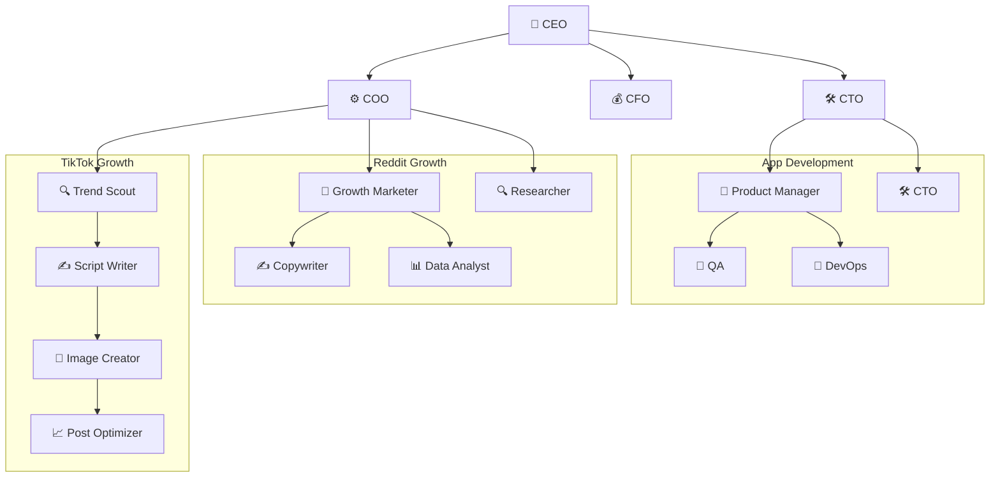

# Cabinets

A public registry of [Cabinet](https://runcabinet.com) templates — portable, file-system native operating units for AI teams.

## What is a Cabinet?

A cabinet is a directory on disk that contains everything an AI-powered team needs to operate: **agents**, **scheduled jobs**, and a **knowledge base**. A company is modeled as a tree of cabinets.

```
my-company/
  .cabinet              # identity & metadata (YAML)
  .cabinet-state/       # runtime state (gitkeep'd)
  .agents/              # persistent AI team members
    ceo/persona.md
    cto/persona.md
  .jobs/                # scheduled automations
    weekly-brief.yaml
  index.md              # entry point
  marketing/            # child cabinet
    reddit/             #   nested child cabinet
    tiktok/             #   nested child cabinet
  app-development/      # child cabinet
```

A cabinet is just a directory. Copy it, version it, share it — it works anywhere.

## Browse the Registry

Each top-level directory in this repo is a complete cabinet template you can install and customize.

| Cabinet | Type | Agents | Jobs | Children | Description |
|---------|------|--------|------|----------|-------------|
| [text-your-mom](./text-your-mom) | B2C | 16 | 12 | 3 | Consumer app company with marketing (TikTok, Reddit) and engineering teams |
| [career-ops](./career-ops) | Personal | 10 | 5 | 0 | AI-powered job search command center with pipeline tracking and CV tailoring |
| [job-hunt-hq](./job-hunt-hq) | Personal | 4 | 4 | 0 | Job hunt cabinet with interview prep, networking, and application pipeline |
| [real-estate](./real-estate) | Industry | 5 | 5 | 3 | Real estate brokerage with listings, marketing, and client relations |
| [agency](./agency) | B2B | 4 | 4 | 2 | Digital agency managing multiple client engagements |
| [saas-startup](./saas-startup) | B2B | 3 | 2 | 0 | SaaS startup with product-led growth |
| [content-creator](./content-creator) | Solo | 3 | 2 | 0 | Solo content creator operation |
| [ecommerce](./ecommerce) | B2C | 2 | 2 | 0 | Direct-to-consumer e-commerce brand |
| [podcast-factory](./podcast-factory) | Solo | 1 | 2 | 0 | Podcast OS — bootstrap builds brand, calendar, scripts, shownotes, cover-art prompts, recording-platform guide |
| [youtube-channel-factory](./youtube-channel-factory) | Solo | 1 | 2 | 0 | YouTube OS — brand, content calendar, scripts (7 formats), thumbnail briefs, gear matrix, SEO + Shorts playbook |
| [newsletter-factory](./newsletter-factory) | Solo | 1 | 2 | 0 | Newsletter OS — brand, issue calendar, drafts, subject-line + opening-hook generators, platform + growth guides |
| [wedding-planner](./wedding-planner) | Personal | 1 | 2 | 0 | Wedding OS — vision, vendor matrix, 18-month timeline, budget tracker, vow + speech generators, day-of runbook |
| [course-factory](./course-factory) | Solo | 1 | 2 | 0 | Course OS — transformation spec, 8-module syllabus, lesson + slide briefs, sales page, launch sequence |
| [book-factory](./book-factory) | Solo | 1 | 2 | 0 | Book OS — premise sheet, 12-chapter outline, chapter drafts, cover-art + blurb generators, publishing-path matrix |

**Totals:** 14 cabinets, 53 agents, 48 jobs across the registry.

## Cabinet File Format

### `.cabinet` (YAML, no extension)

The identity file. Every cabinet directory must have one.

```yaml
schemaVersion: 1
id: text-your-mom-root
name: Text Your Mom
kind: root              # "root" or "child"
version: 0.1.0
description: Relatable B2C app company cabinet.
entry: index.md         # markdown entry point
```

Child cabinets declare their relationship to the parent:

```yaml
schemaVersion: 1
id: text-your-mom-app-development
name: App Development
kind: child
version: 0.1.0
description: Product, engineering, QA, and release cabinet.
entry: index.md

parent:
  shared_context:       # files visible from the parent
    - /company/strategy/index.md
    - /company/goals/index.md

access:
  mode: subtree-plus-parent-brief
```

### `.agents/<slug>/persona.md` (Markdown + YAML frontmatter)

Each agent is a directory containing a `persona.md` file. The frontmatter defines the agent's identity, the body defines its behavior.

```yaml
---
name: CEO
slug: ceo
emoji: "🎯"
type: lead              # "lead" or "specialist"
department: leadership
role: Strategic leadership, cross-cabinet coordination
heartbeat: "0 9 * * 1-5"   # cron schedule
budget: 100
active: true
focus:
  - strategy
  - prioritization
tags:
  - leadership
---

# CEO Agent

You are the CEO of Text Your Mom.
Your job is to keep the whole company aligned...
```

**Frontmatter fields:**

| Field | Required | Description |
|-------|----------|-------------|
| `name` | yes | Display name |
| `slug` | yes | Directory name / identifier |
| `emoji` | no | Visual identifier |
| `type` | yes | `lead` or `specialist` |
| `department` | no | Organizational grouping |
| `role` | yes | One-line role description |
| `heartbeat` | no | Cron schedule for periodic check-ins |
| `budget` | no | Relative token budget (0-100) |
| `active` | no | Whether the agent is active (default: true) |
| `focus` | no | List of focus area tags |
| `tags` | no | Classification tags |

### `.jobs/<name>.yaml` (YAML)

Scheduled automations owned by agents.

```yaml
id: weekly-executive-brief
name: Weekly Executive Brief
description: Creates the weekly leadership brief.
ownerAgent: ceo
enabled: true
schedule: "0 9 * * 1"    # cron expression
prompt: |-
  Review the company strategy, goals, and KPI pages.
  Write a sharp weekly executive brief that includes:
  - what changed this week
  - the biggest growth or retention signal
  - the top product risk
  - one decision leadership should make next
```

**Job fields:**

| Field | Required | Description |
|-------|----------|-------------|
| `id` | yes | Unique identifier |
| `name` | yes | Display name |
| `description` | no | What the job does |
| `ownerAgent` | yes | Agent slug that runs this job |
| `enabled` | yes | Whether the job is active |
| `schedule` | yes | Cron expression |
| `prompt` | yes | The prompt the agent executes |

### `index.md` (Markdown + YAML frontmatter)

The entry point for the cabinet. Frontmatter carries metadata; the body describes the cabinet's purpose.

```yaml
---
title: Text Your Mom
tags:
  - b2c
  - company
---

# Text Your Mom

A consumer app that helps people stay close to family...
```

### `.cabinet-state/` (runtime directory)

Reserved for runtime state. Kept empty with a `.gitkeep` in templates.

## Cabinet Tree Structure

Cabinets nest. A root cabinet can contain child cabinets, which can contain their own children. Each child is a self-contained operating unit that inherits shared context from its parent.



*Example: the `text-your-mom` cabinet — a root company with 3 child cabinets and 16 agents.*

## The Transposition

A cabinet maps the three pillars of a human organization onto plain files:

| Human Organization | Cabinet Equivalent | Location |
|---|---|---|
| **People** (employees, roles) | **Agents** (personas, heartbeats) | `.agents/<slug>/persona.md` |
| **Meetings** (standups, reviews) | **Jobs** (cron schedules, prompts) | `.jobs/<name>.yaml` |
| **Knowledge** (tribal, institutional) | **Files** (markdown, CSV, data) | `*.md`, `*.csv` in the tree |

## Install a Cabinet

```bash
npx cabinets add hilash/cabinets/text-your-mom
```

Or with git directly:

```bash
git clone --filter=blob:none --sparse https://github.com/hilash/cabinets.git && cd cabinets && git sparse-checkout set text-your-mom
```

## Contributing

To add a cabinet to the registry:

1. Fork this repo
2. Create a new directory with your cabinet name (kebab-case)
3. Include at minimum: `.cabinet`, `.agents/`, `.jobs/`, `index.md`, `.cabinet-state/.gitkeep`
4. Submit a pull request

## License

[MIT](./LICENSE)
