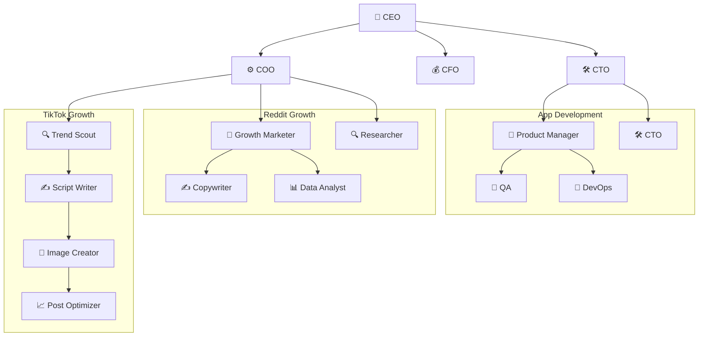

# Cabinets

A public registry of [Cabinet](https://runcabinet.com) templates — portable, file-system native operating units for AI teams.

## What is a Cabinet?

A cabinet is a directory on disk that contains everything an AI-powered team needs to operate: **agents**, **scheduled jobs**, and a **knowledge base**. A company is modeled as a tree of cabinets.

```
my-company/
  .cabinet              # identity & metadata (YAML, no extension)
  .cabinet-state/       # runtime state (gitkeep'd, never committed)
  .agents/              # persistent AI team members
    ceo/
      persona.md        # agent identity, heartbeat, behavior
    cto/
      persona.md
  .jobs/                # scheduled automations
    weekly-brief.yaml
  cover.jpg             # registry cover image (1200×630)
  index.md              # entry point with frontmatter
  marketing/            # child cabinet
    reddit/             #   nested child cabinet
    tiktok/             #   nested child cabinet
  app-development/      # child cabinet
```

A cabinet is just a directory. Copy it, version it, share it — it works anywhere.

## Browse the Registry

Each top-level directory in this repo is a complete cabinet template you can install and customize. The registry has two collections: the original **personal & creator** templates, and a **76-cabinet enterprise suite** organized by department (below).

### Personal & creator templates

| Cabinet | Domain | Agents | Jobs | Children | Description |
|---------|--------|--------|------|----------|-------------|
| [agency](./agency) | Professional Services | 2 | 2 | 2 | Digital agency managing multiple client engagements |
| [ai-hero](./ai-hero) | Education | 2 | 2 | 0 | Self-paced AI course from Python up through GPT-2 construction |
| [audits](./audits) | Operations | 1 | 2 | 0 | End-to-end product audits — walk every surface, file each friction as a markdown issue, ship fixes with a 20-yr Senior Product Lead bar, hand stakeholder an interactive review slideshow |
| [biology-experiments](./biology-experiments) | Education | 1 | 1 | 0 | Five browser-based simulations of landmark biology experiments |
| [book-factory](./book-factory) | Media | 1 | 2 | 0 | Book OS — premise, outline, chapter draft, blurb, and publishing-path matrix |
| [career-ops](./career-ops) | Operations | 2 | 5 | 0 | AI-powered job search command center with pipeline tracking and CV tailoring |
| [content-creator](./content-creator) | Media | 2 | 2 | 0 | Solo content creator operation with strategy, editing, and analytics |
| [cooking](./cooking) | Lifestyle | 1 | 1 | 0 | Pantry tracker, recipe suggestions, and weekly meal-plan generator |
| [course-factory](./course-factory) | Education | 1 | 2 | 0 | Course OS — curriculum, lessons, sales page, and launch sequence |
| [ecommerce](./ecommerce) | E-commerce | 2 | 2 | 0 | DTC brand with inventory, email marketing, and fulfillment ops |
| [fitness](./fitness) | Lifestyle | 1 | 1 | 0 | Strength and conditioning tracker with smart deload suggestions |
| [job-hunt-hq](./job-hunt-hq) | Operations | 2 | 4 | 0 | Career strategist, resume tailor, interview coach, and networking scout |
| [keto-hq](./keto-hq) | Lifestyle | 2 | 4 | 0 | Macros, electrolytes, stall diagnosis, and meal planning for keto protocol |
| [mom-command](./mom-command) | Lifestyle | 1 | 2 | 0 | Root cabinet for the Mom & Baby series — shared family context and data |
| [music-factory](./music-factory) | Media | 0 | 0 | 0 | Browser-native MIDI factory with piano roll, Web Audio playback, and .mid export |
| [newborn](./newborn) | Lifestyle | 1 | 2 | 0 | Survival tracker for weeks 0–12 — feeds, sleep, milestones, red flags |
| [newsletter-factory](./newsletter-factory) | Media | 1 | 2 | 0 | Newsletter OS — brand voice, calendar, drafts, subject-line generators, platform guide |
| [personal-os](./personal-os) | Operations | 1 | 1 | 6 | Second-brain cabinet with six life areas (brain, family, home, money, health, play) |
| [physics-101](./physics-101) | Education | 1 | 1 | 0 | 6-module beginner curriculum — Motion through Light, no calculus required |
| [physics-experiments](./physics-experiments) | Education | 1 | 1 | 0 | Five browser-based simulations of classic physics experiments |
| [podcast-factory](./podcast-factory) | Media | 1 | 2 | 0 | Podcast OS — brand, calendar, scripts, shownotes, and recording-platform guide |
| [reading-room](./reading-room) | Education | 1 | 1 | 0 | Private Goodreads — TBR, ratings, what-I-learned notes, year-in-review |
| [real-estate](./real-estate) | Sales | 2 | 2 | 3 | Real estate brokerage with listings management, marketing, and client relations |
| [saas-startup](./saas-startup) | Software | 2 | 2 | 0 | B2B SaaS with product-led growth, engineering, and customer success |
| [text-your-mom](./text-your-mom) | Software | 2 | 3 | 3 | B2C app company with TikTok, Reddit, and engineering child cabinets |
| [usa-travel-planner](./usa-travel-planner) | Lifestyle | 2 | 3 | 0 | National parks map, state fairs, and event-hunter agent for US travel |
| [venture-capital](./venture-capital) | Professional Services | 5 | 5 | 0 | Early-stage VC firm OS — deal sourcing and thesis scoring, portfolio health monitoring, market research, and LP updates |
| [wedding-planner](./wedding-planner) | Lifestyle | 1 | 2 | 0 | Wedding OS — timeline, budget tracker, vow generators, and day-of runbook |
| [youtube-channel-factory](./youtube-channel-factory) | Media | 1 | 2 | 0 | YouTube OS — brand, calendar, scripts, thumbnail briefs, and gear guide |

### Enterprise department templates

A department-organized suite of B2B enterprise Cabinets. Pick a department, pick the workflow you run manually today, connect the systems of record you can’t replace — Cabinet replaces the docs, dashboards, trackers, and status rituals around them. The flagship **[competitive-intelligence](./competitive-intelligence)** cabinet publishes daily/weekly/monthly competitor reports, and Sales/CS/Product/Marketing/Exec/Strategy cabinets carry a competitor-watch routine that feeds it.

| Cabinet | Domain | Agents | Jobs | Description |
|---------|--------|--------|------|-------------|
| [competitive-intelligence](./competitive-intelligence) | Operations | 3 | 4 | ⭐ Cross-company competitive intelligence command center |
| **Executive / CEO Office** | | | | |
| [ceo-operating](./ceo-operating) | Operations | 3 | 4 | Run company priorities, leadership decisions, risks, and operating cadence from one place |
| [board-memo](./board-memo) | Operations | 3 | 4 | Generate monthly and quarterly board updates covering product, revenue, finance, hiring, risks, and asks |
| [investor-update](./investor-update) | Operations | 2 | 2 | Write monthly investor updates from live company data and leadership notes |
| [leadership-meeting](./leadership-meeting) | Operations | 2 | 2 | Prepare leadership meeting agendas, summarize decisions, and track action items across every weekly meeting |
| **Strategy / Operations** | | | | |
| [okr-command](./okr-command) | Operations | 3 | 2 | The living OKR board for your company and every department |
| [weekly-business-review](./weekly-business-review) | Operations | 2 | 2 | Auto-generates the weekly business review across revenue, product, support, engineering, and finance |
| [decision-log](./decision-log) | Operations | 2 | 1 | Extracts and preserves every material decision made in meetings, Slack, docs, and email |
| [strategic-initiative](./strategic-initiative) | Operations | 2 | 2 | The initiative room for cross-functional strategic programs — pricing changes, market launches, reorgs |
| **Sales** | | | | |
| [account-room](./account-room) | Sales | 3 | 4 | One living workspace per account — stakeholders, history, open opportunities, objections, and next steps |
| [pipeline-risk](./pipeline-risk) | Sales | 2 | 3 | Identify risky deals, stale opportunities, missing champions, and weak next steps before they cost you the quarter |
| [sales-battlecard](./sales-battlecard) | Sales | 2 | 3 | Per-competitor battlecards with objection handling, proof points, pricing deltas, and recommended collateral |
| [proposal-rfp](./proposal-rfp) | Sales | 3 | 3 | Draft proposals and RFP responses using customer context, pricing, security answers, and case studies |
| [ae-csm-handoff](./ae-csm-handoff) | Sales | 2 | 3 | Turn closed-won deal context into a clean, structured onboarding handoff for Customer Success |
| [sales-call-prep](./sales-call-prep) | Sales | 2 | 2 | Prep reps for every call with account context, recent activity, likely pain points, and discovery questions |
| **Customer Success** | | | | |
| [customer-health](./customer-health) | Sales | 2 | 4 | Always-on customer health command center — health scores, usage trends, tickets, and renewal risk |
| [qbr-generator](./qbr-generator) | Sales | 2 | 3 | Turns raw customer data into polished Quarterly Business Review content — goals, adoption, ROI, next quarter |
| [renewal-risk](./renewal-risk) | Sales | 2 | 3 | Surfaces upcoming renewals, risk levels, expansion potential, and required actions across the book |
| [customer-escalation](./customer-escalation) | Sales | 3 | 3 | Converts escalation chaos into a structured packet — timeline, customer impact, root cause, owner plan |
| **Customer Support** | | | | |
| [support-intelligence](./support-intelligence) | Operations | 2 | 2 | Clusters tickets by theme, surfaces recurring pain, and ships a weekly support insights report |
| [bug-escalation](./bug-escalation) | Operations | 2 | 2 | Turns raw customer tickets into engineering-ready bug reports with repro steps and customer impact |
| [help-center](./help-center) | Operations | 2 | 2 | Drafts and maintains help articles from real customer questions and product release notes |
| [support-macro](./support-macro) | Operations | 2 | 2 | Generates and QA-reviews a library of reusable support macros from real ticket clusters |
| **Product** | | | | |
| [voice-of-customer](./voice-of-customer) | Software | 3 | 3 | Collects, clusters, and quantifies feedback across support, sales calls, reviews, and chat |
| [feature-request](./feature-request) | Software | 2 | 2 | Ingests feature requests from every channel and publishes a RICE-scored, prioritized board |
| [roadmap](./roadmap) | Software | 2 | 2 | Builds data-backed Now/Next/Later roadmap proposals from goals, feedback, capacity, and impact |
| [prd-builder](./prd-builder) | Software | 3 | 3 | Generates structured PRD drafts from customer pain, goals, and constraints — with a completeness QA pass |
| [product-launch](./product-launch) | Software | 2 | 3 | Manages the launch lifecycle — checklist, owners, assets, risks, comms, and release notes |
| [experiment-review](./experiment-review) | Software | 2 | 2 | Tracks hypotheses, variants, metrics, and decisions in a structured experiment readout + log |
| **Engineering** | | | | |
| [sprint-planning](./sprint-planning) | Software | 2 | 2 | Automated sprint preparation and daily standup digest for engineering teams |
| [engineering-status](./engineering-status) | Software | 2 | 1 | Auto-generated weekly engineering update from GitHub, Jira, and Linear |
| [release-notes](./release-notes) | Software | 2 | 2 | Turns merged PRs and completed issues into internal and customer-facing release notes |
| [incident-postmortem](./incident-postmortem) | Software | 3 | 2 | Builds incident timelines, root-cause analyses, and action-item registers from your observability stack |
| [architecture-decision](./architecture-decision) | Software | 2 | 2 | Maintains a living ADR library — decisions, tradeoffs, owners, diagrams, and rationale |
| [bug-triage](./bug-triage) | Software | 2 | 2 | Daily bug triage from Sentry, GitHub, Jira, and Support — ranked by severity, impact, and frequency |
| **IT** | | | | |
| [it-request](./it-request) | Operations | 2 | 2 | Structured IT request intake and routing for modern teams |
| [access-approval](./access-approval) | Operations | 2 | 2 | Policy-aware access request intake, compliance check, and approval routing |
| [app-directory](./app-directory) | Operations | 2 | 2 | Always-current SaaS inventory — every app, owner, user count, cost, renewal, and SSO status |
| [employee-offboarding](./employee-offboarding) | Operations | 2 | 2 | End-to-end employee offboarding orchestration for IT and HR teams |
| [change-management](./change-management) | Operations | 2 | 2 | Structured change request docs, risk scoring, and CAB approval routing |
| **HR / People** | | | | |
| [new-hire-onboarding](./new-hire-onboarding) | Operations | 2 | 2 | Structured onboarding workspace for every new employee — pre-boarding to 30-day mark |
| [hr-policy-assistant](./hr-policy-assistant) | Operations | 2 | 2 | Instant, sourced answers to employee policy questions — PTO, benefits, leave, remote work |
| [performance-review](./performance-review) | Operations | 3 | 2 | Performance review packets from goals, manager notes, peer feedback, and shipped work |
| [candidate-packet](./candidate-packet) | Operations | 2 | 2 | Candidate packets for hiring committees — resume, interview digest, scorecards, recommendation |
| [hiring-pipeline](./hiring-pipeline) | Operations | 2 | 2 | Talent ops command center — open roles, funnel, time-to-fill, bottlenecks, and headcount plan |
| [manager-one-on-one](./manager-one-on-one) | Operations | 2 | 2 | Per-report 1:1 workspace — agenda, running notes, action items, goals, and feedback log |
| **Finance** | | | | |
| [finance-memo](./finance-memo) | Professional Services | 2 | 2 | Turns ERP and payroll data into a polished monthly CFO memo — revenue, burn, runway, variance |
| [budget-variance](./budget-variance) | Professional Services | 2 | 2 | Compares budget vs. actuals by department monthly, flags overspend, explains drivers |
| [vendor-renewal](./vendor-renewal) | Professional Services | 2 | 2 | Tracks SaaS renewal dates, notice windows, owners, and spend — alerts before cancellation windows close |
| [spend-policy](./spend-policy) | Professional Services | 2 | 2 | Answers "can I expense this?", flags anomalous spend, and keeps department summaries current |
| [board-finance](./board-finance) | Professional Services | 2 | 2 | Assembles the CFO's board finance section — ARR, burn multiple, runway, plan vs. actual, risks |
| **Procurement / Operations** | | | | |
| [procurement-intake](./procurement-intake) | Operations | 3 | 2 | Turns vendor/tool requests into an approval packet — cost, risk, alternatives, compliance, decision |
| [vendor-asset](./vendor-asset) | Operations | 1 | 2 | Single source of truth for equipment, software licences, and vendor relationships |
| [universal-request](./universal-request) | Operations | 2 | 2 | One intake flow for every team — marketing, IT, finance, design, legal, data, and ops |
| [office-ops](./office-ops) | Operations | 1 | 2 | Keeps the office running — visitors, supplies, facilities tickets, and recurring tasks |
| **Legal** | | | | |
| [contract-intelligence](./contract-intelligence) | Professional Services | 2 | 2 | Turns executed contracts into structured summaries — obligations, renewal terms, risk flags, owners |
| [legal-request](./legal-request) | Professional Services | 2 | 2 | Structured intake for legal requests — classify, gather info, route to counsel, track SLA |
| [contract-renewal](./contract-renewal) | Professional Services | 2 | 2 | Tracks renewal dates, notice windows, auto-renew risk, and pricing changes across contracts |
| [clause-library](./clause-library) | Professional Services | 2 | 2 | A living library of approved clauses — standard language, fallbacks, negotiation notes, risk |
| **Security / Compliance** | | | | |
| [security-questionnaire](./security-questionnaire) | Professional Services | 3 | 2 | Auto-answers customer/vendor security questionnaires from your policies, SOC2 docs, and past answers |
| [compliance-evidence](./compliance-evidence) | Professional Services | 2 | 2 | Collects and maps evidence — policies, screenshots, logs — to SOC2, ISO 27001, and GDPR controls |
| [risk-register](./risk-register) | Professional Services | 2 | 2 | Tracks security & operational risks with owners, likelihood-impact scores, and mitigation plans |
| [vendor-security-review](./vendor-security-review) | Professional Services | 2 | 3 | Assesses vendor risk via SOC2, DPA status, and sub-processors — producing an approval packet |
| **Marketing** | | | | |
| [campaign-launch](./campaign-launch) | Media | 2 | 3 | End-to-end campaign operations from brief to launch to performance review |
| [content-calendar](./content-calendar) | Media | 2 | 2 | Plan, draft, schedule, and review all content — from idea to published to performance |
| [seo-content](./seo-content) | Media | 2 | 3 | Keyword research, content briefs, rankings tracking, and refresh tasks in one workspace |
| [ad-performance](./ad-performance) | Media | 2 | 2 | Paid media in one dashboard — spend, CAC, ROAS, creative winners/losers, next experiments |
| [brand-hub](./brand-hub) | Media | 2 | 2 | Logos, colors, typography, messaging pillars, approved copy, and do/don't guidelines |
| [competitive-marketing](./competitive-marketing) | Media | 2 | 2 | The marketing cut of competitive intel — messaging, campaigns, SEO/ad presence, share of voice |
| **Data / Analytics** | | | | |
| [kpi-narrative](./kpi-narrative) | Software | 2 | 2 | Converts dashboard data into plain-English business explanations and weekly metric narratives |
| [metrics-definition](./metrics-definition) | Software | 2 | 2 | The canonical glossary for every business metric — owner, formula, source table, certified status |
| [data-request](./data-request) | Software | 2 | 2 | Structured intake, triage, and delivery for every business data question |
| **General Company Knowledge** | | | | |
| [company-brain](./company-brain) | Operations | 2 | 2 | The AI-native knowledge base that makes every doc findable and every question answerable |
| [meeting-memory](./meeting-memory) | Operations | 2 | 2 | Captures every meeting as structured memory — summaries, decisions, action items, owners |
| [internal-faq](./internal-faq) | Operations | 2 | 2 | Instant, sourced answers to HR, IT, finance, and policy questions — without opening a ticket |
| [team-wiki](./team-wiki) | Operations | 2 | 2 | A living team page — responsibilities, projects, rituals, key docs, and on-call ownership |

**Totals:** 106 cabinets, 211 agents, 235 jobs across the registry (30 personal & creator + 76 enterprise).

## Cabinet File Format

### `.cabinet` (YAML, no extension)

The identity file. Every cabinet directory must have one.

```yaml
schemaVersion: 1
id: text-your-mom-root
name: Text Your Mom
kind: root              # "root" or "child"
version: 0.1.0
description: Relatable B2C app company cabinet.
entry: index.md         # markdown entry point
```

Child cabinets declare their relationship to the parent:

```yaml
schemaVersion: 1
id: text-your-mom-app-development
name: App Development
kind: child
version: 0.1.0
description: Product, engineering, QA, and release cabinet.
entry: index.md

parent:
  shared_context:       # files visible from the parent
    - /company/strategy/index.md
    - /company/goals/index.md

access:
  mode: subtree-plus-parent-brief
```

### `.agents/<slug>/persona.md` (Markdown + YAML frontmatter)

Each agent is a directory containing a `persona.md` file. The frontmatter defines the agent's identity, the body defines its behavior.

```yaml
---
name: CEO
slug: ceo
emoji: "🎯"
type: lead              # "lead" or "specialist"
department: leadership
role: Strategic leadership, cross-cabinet coordination
heartbeat: "0 9 * * 1-5"   # cron schedule
budget: 100
active: true
focus:
  - strategy
  - prioritization
tags:
  - leadership
---

# CEO Agent

You are the CEO of Text Your Mom.
Your job is to keep the whole company aligned...
```

**Frontmatter fields:**

| Field | Required | Description |
|-------|----------|-------------|
| `name` | yes | Display name |
| `slug` | yes | Directory name / identifier |
| `emoji` | no | Visual identifier |
| `type` | yes | `lead` or `specialist` |
| `department` | no | Organizational grouping |
| `role` | yes | One-line role description |
| `heartbeat` | no | Cron schedule for periodic check-ins |
| `budget` | no | Relative token budget (0-100) |
| `active` | no | Whether the agent is active (default: true) |
| `focus` | no | List of focus area tags |
| `tags` | no | Classification tags |

### `.jobs/<name>.yaml` (YAML)

Scheduled automations owned by agents.

```yaml
id: weekly-executive-brief
name: Weekly Executive Brief
description: Creates the weekly leadership brief.
ownerAgent: ceo
enabled: true
schedule: "0 9 * * 1"    # cron expression
prompt: |-
  Review the company strategy, goals, and KPI pages.
  Write a sharp weekly executive brief that includes:
  - what changed this week
  - the biggest growth or retention signal
  - the top product risk
  - one decision leadership should make next
```

**Job fields:**

| Field | Required | Description |
|-------|----------|-------------|
| `id` | yes | Unique identifier |
| `name` | yes | Display name |
| `description` | no | What the job does |
| `ownerAgent` | yes | Agent slug that runs this job |
| `enabled` | yes | Whether the job is active |
| `schedule` | yes | Cron expression |
| `prompt` | yes | The prompt the agent executes |

### `index.md` (Markdown + YAML frontmatter)

The entry point for the cabinet. Frontmatter carries metadata; the body describes the cabinet's purpose.

```yaml
---
title: Text Your Mom
tags:
  - b2c
  - company
---

# Text Your Mom

A consumer app that helps people stay close to family...
```

### `cover.jpg`

The registry cover image shown in the Cabinet app carousel and browser. Every cabinet in this registry ships with one.

- **Size:** 1200×630 px
- **File size:** under 100 KB
- **Style:** pastel, minimalist, flat — soft gradient background, a single centered icon or simple illustration, the cabinet name in clean sans-serif. No photos, no busy layouts.

### `.cabinet-state/` (runtime directory)

Reserved for runtime state — conversation history, agent memory, generated outputs. Kept empty with a `.gitkeep` in templates so the directory exists but nothing inside gets committed.

## Cabinet Tree Structure

Cabinets nest. A root cabinet can contain child cabinets, which can contain their own children. Each child is a self-contained operating unit that inherits shared context from its parent.



*Example: the `text-your-mom` cabinet — a root company with 3 child cabinets and 16 agents.*

## The Transposition

A cabinet maps the three pillars of a human organization onto plain files:

| Human Organization | Cabinet Equivalent | Location |
|---|---|---|
| **People** (employees, roles) | **Agents** (personas, heartbeats) | `.agents/<slug>/persona.md` |
| **Meetings** (standups, reviews) | **Jobs** (cron schedules, prompts) | `.jobs/<name>.yaml` |
| **Knowledge** (tribal, institutional) | **Files** (markdown, CSV, data) | `*.md`, `*.csv` in the tree |

## Install a Cabinet

```bash
npx cabinets add hilash/cabinets/text-your-mom
```

Or with git directly:

```bash
git clone --filter=blob:none --sparse https://github.com/hilash/cabinets.git && cd cabinets && git sparse-checkout set text-your-mom
```

## Community

Have a cabinet idea? Want to see what others are building?

Join the **[Cabinet Discord](https://discord.com/invite/hJa5TRTbTH)**:

- **`#cabinets` channel** — request a cabinet you'd like to see, upvote others' ideas, or share one you built
- Ask questions about the format, get feedback on your structure, or just lurk and see what's coming next

## Contributing

Want to add a cabinet to the registry? Here's the full checklist.

### Required files

Every cabinet must include these files — no exceptions:

```
my-cabinet/
  .cabinet                      # YAML identity file (see schema above)
  .cabinet-state/
    .gitkeep                    # keeps the dir in git; nothing else goes here
  .agents/
    <slug>/
      persona.md                # at least one agent
  .jobs/
    <name>.yaml                 # at least one job
  index.md                      # entry point with YAML frontmatter
  cover.jpg                     # 1200×630 px, < 100 KB, pastel minimalist style
```

### Steps

1. Scaffold with `npx create-cabinet` or copy an existing cabinet as a starting point
2. Fill in real content — agents with clear personas, jobs with useful prompts, an `index.md` that explains the cabinet's purpose
3. Add a `cover.jpg` that matches the registry style: pastel background, single icon or simple illustration, cabinet name in clean sans-serif
4. Run `node .github/scripts/build-manifest.mjs` locally and confirm your cabinet appears in `manifest.json`
5. Fork this repo, add your cabinet directory, and open a pull request — CI rebuilds the manifest on merge

Not sure where to start or want feedback before opening a PR? Post in the [#cabinets channel on Discord](https://discord.com/invite/hJa5TRTbTH).

## License

[MIT](./LICENSE)
