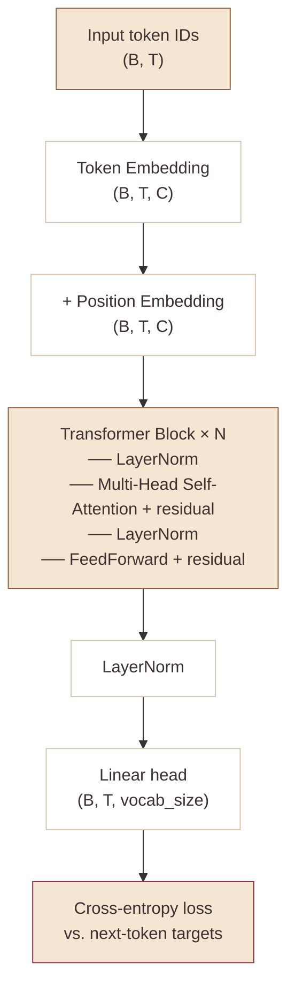

# 🤖 4.9 — Let's build GPT: from scratch, in code, spelled out

**Time:** 2 hours of video.
**Title:** *Let's build GPT: from scratch, in code, spelled out.*

The one you've been waiting for. You build a GPT-2-like transformer from scratch and train it on Tiny Shakespeare. By the end of this video you have your own mini-LLM that produces output that *kind of* looks like Shakespeare.

## Watch

<iframe width="720" height="405" src="https://www.youtube.com/embed/kCc8FmEb1nY" title="Let's build GPT: from scratch, in code, spelled out" frameborder="0" allow="accelerometer; autoplay; clipboard-write; encrypted-media; gyroscope; picture-in-picture" allowfullscreen></iframe>

Direct link: [Let's build GPT — YouTube](https://www.youtube.com/watch?v=kCc8FmEb1nY)

## What you build

A decoder-only transformer. GPT-2 nano. Yours.



## 🎛️ Play with the core operation

The single most important webapp in this cabinet for Stage 4: **[[../../attention-viz/index|Attention Visualizer]]**. Click any token in a sentence — see who it attends to as a heatmap, with the causal mask toggleable. Poke at this before you watch Karpathy's attention derivation. It will click faster.

## Key concepts introduced

- **Self-attention** from first principles. Starting with a "weighted sum where the weights come from the input itself."
- **Keys, queries, values** — the three projections, what each one *means*
- **Causal masking** — the triangular mask that makes the attention autoregressive (tokens can only see past, not future)
- **Multi-head attention** — run attention in parallel across separate subspaces
- **Positional encodings** — since attention is permutation-invariant, you need to inject position
- **Layer normalization** vs. batch normalization — LayerNorm normalizes per-sample across the feature dim
- **Residual connections** and why they're the real trick that makes deep transformers trainable

## Pay extra attention at these moments

- The **mathematical toy** at the start: how "average all previous tokens" becomes "attention" step by step. This is the whole trick. Pause here for as long as you need.
- The scaling by `1/sqrt(d_k)` in attention — why is it there? (Variance at init.)
- When he moves the LayerNorm to pre-norm (before attention, before FFN). Modern transformers all do this.
- The training loop — most of it you've seen before from makemore

## Get the data

```bash
wget https://raw.githubusercontent.com/karpathy/char-rnn/master/data/tinyshakespeare/input.txt
```

## Checklist

- [ ] Watched the full video, typing along
- [ ] Implemented single-head self-attention
- [ ] Implemented multi-head self-attention
- [ ] Added positional embeddings
- [ ] Built the full transformer block (attention + FFN + residuals + LayerNorm)
- [ ] Trained my GPT on Tiny Shakespeare
- [ ] Generated samples — they should look like fake Shakespeare (words may not be real English, but cadence should feel right)

## Sample I generated

```

```

## My notes

```

```

## Next

**[[../10-gpt-addition/index|4.10 GPT addition exercise →]]** — teach your transformer to add.
