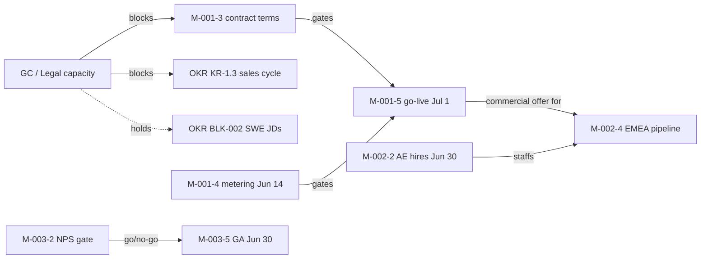

# Strategic Initiative Risk Narrative — Week 25 · June 19, 2026

_Initiative Analyst · Source: `data/initiatives.yaml` · milestone data unverified since May 23 (4-week blackout)_

---

**Portfolio headline:** Last week's call was "re-establish ground truth by June 13." It is June 19: the registry hasn't moved, every June-13/16 mitigation deadline lapsed unrecorded, and three flagship milestones — go-live (Jul 1), GA and EMEA AE hires (both Jun 30) — sit 11–12 days out, unverified. The portfolio is blind *and* out of runway.

---

## High Risks (Red)

**R-001-1 · Pricing — legal delay cascades to go-live · 5×5 = 25 ↑(was 20) · systemic (5 wks).** Impact raised to 5 — the slip now hits the Jul 1 go-live *and* the downstream EMEA offer. The GC redline (DEC-001) is 22 days overdue, sharing the queue with OKR BLK-001 (KR-1.3, Red). **Mitigation:** Sarah Chen secures a written GC ruling by **Mon Jun 22**; if not cleared, James Liu moves go-live to Jul 15 at the Jun 23 gate review, announced same day.

**R-001-2 · Pricing — usage metering incomplete · 4×5 = 20 ↑(was 15).** Jun 14 delivery unverified; without it, usage billing cannot launch. **Mitigation:** Ana Kowalski confirms staging delivery in writing by **Jun 22**; if slipped, go-live re-baselines to Jul 15 on Jun 23.

**R-002-1 · EMEA — AE hiring misses Jun 30 · 5×4 = 20 ↑(was 16) · systemic (5 wks).** Offer deadline is tomorrow; the Jun 1 agency engagement unconfirmed; pipeline thin. Ties to OKR KR-3.1 (Red, BLK-002). **Mitigation:** Marcus Webb confirms a signed AE offer by **EOD Jun 20**; if none, reset M-002-2 to Jul 31 on Jun 22 and re-baseline the Q3 pipeline target — don't wait for Jun 30.

**R-003-1 · AI GA — NPS gate unrecorded · 5×4 = 20 ↑(was 16) · systemic (5 wks).** NPS re-check is 19 days overdue (last 38 vs 42 = OKR KR-2.2); GA still Jun 30. **Mitigation:** Tom Bergmann publishes NPS by **Mon Jun 22**; if below 40, Priya Nair issues the Jul 14 GA delay on Jun 23 — GA cannot ship on an unpublished gate.

## Medium Risks (Amber)

- **R-002-2 · EU data residency · 10 · flat:** Priya Nair files written Jul 15 cert status at the Jun 23 review; EMEA stays demo-stage until certified.
- **R-003-2 · CS enablement · 6 · flat:** Tom Bergmann confirms by Jun 22 the Jun 20 session ran or is rebooked before GA.

## Interdependencies

**Legal/GC capacity is the single shared cascade node across both cabinets** — it gates pricing contract terms → go-live → the EMEA offer, and holds OKR BLK-001 and BLK-002 (SWE JDs, same headcount plan as the EMEA AEs). One understaffed function throttles revenue, product, and ops at once.

## Systemic Flags

R-001-1, R-002-1, R-003-1 — each High **5 weeks**. Sponsors Chen, Webb, Nair were escalated June 12; no action followed. **Re-escalating with a hard ask:** each records a written decision by **Mon Jun 22**, or the three Jun-30/Jul-1 milestones slip by default. Root cause unchanged — no verified registry update since May 23; the Workflow Agent's sweep must run before scoring can be trusted.

---

_Next risk review: Fri June 26 · Source: `data/initiatives.yaml`_
