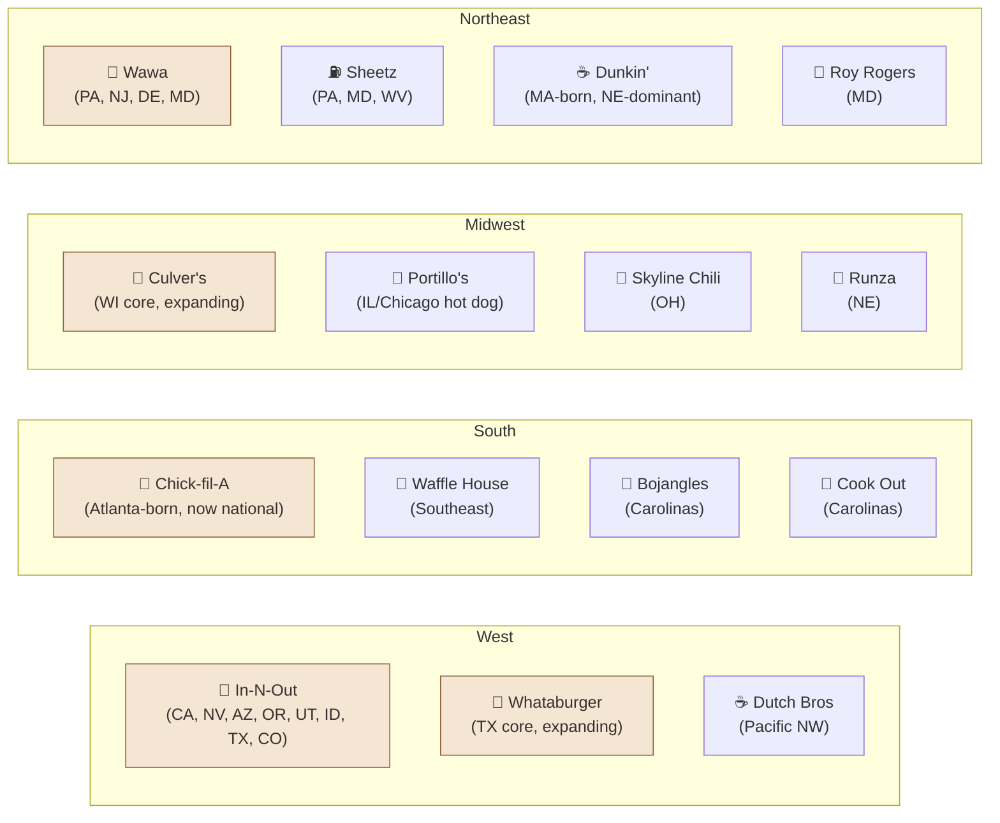

# 🍔 Regional Fast Food — The Map of America by Drive-Thru

Every state has *the* iconic regional chain — the one locals defend and out-of-towners line up for. This section is your cheat sheet.

→ [[by-state|Iconic chain in every state (CSV)]]

## The big regional empires

## BBQ regions — fight me

| Region | Style | Wood | Sauce |
|---|---|---|---|
| **Texas (Central)** | Beef brisket; salt + pepper rub | Post oak | Often none — meat speaks for itself |
| **Carolina (NC East)** | Whole hog | Hickory | Vinegar + pepper |
| **Carolina (NC West / Lexington)** | Pork shoulder | Hickory | Vinegar + ketchup ("dip") |
| **Carolina (SC)** | Pulled pork | Pecan/oak | Mustard-based |
| **Memphis** | Pork ribs (dry); chopped pork sandwich | Hickory | Optional — dry rub is the move |
| **Kansas City** | Burnt ends + ribs | Hickory + oak | Thick, sweet, tomato-based — sauce-forward |
| **Alabama** | White sauce on smoked chicken | Hickory | Mayo + vinegar + black pepper |

## Sandwich strongholds

- **Italian beef** — Chicago, IL (Al's Italian Beef, Portillo's)
- **Cheesesteak** — Philadelphia, PA (Pat's vs. Geno's; the local answer is usually neither — try Jim's or Tony Luke's)
- **Po'boy** — New Orleans, LA (Domilise's, Parkway Bakery)
- **Cubano** — Miami / Tampa, FL (Versailles in Miami, Columbia in Tampa)
- **Lobster roll** — Maine, hot or cold (Red's Eats vs Bite Into Maine)
- **French dip** — Los Angeles, CA (Philippe's vs Cole's — both claim to have invented it)
- **Po-Boy / Beef on Weck** — Buffalo, NY
- **Hoagie** — South Jersey + Philly
- **Italian grinder** — Connecticut + Rhode Island

## Taco zones

- **Breakfast taco** — Austin / San Antonio, TX (corn or flour, eggs + chorizo + beans)
- **Mexican-style street taco** — LA, CA (Mariscos Jalisco, Leo's Tacos)
- **Tex-Mex hard-shell** — Texas (Taco Cabana, regional)
- **Sonoran flour taco** — Tucson, AZ
- **Cal-Mex** — San Diego, CA (Roberto's, Taco Stand)

## Sweet treats by region

- **Frozen custard** — Wisconsin (Culver's, Kopp's, Leon's)
- **Ice cream stand** — New England (Kimball's, Bedford Farms, Lewis Brothers in NJ)
- **Soft serve** — Coney Island, NY + Beach boardwalks everywhere
- **Snowballs** — New Orleans, LA (Hansen's Sno-Bliz)
- **Italian water ice / shaved ice** — Philadelphia, PA (Rita's)
- **Frozen yogurt** — California's tart-yogurt empire (Pinkberry origin)
- **Cinnamon rolls** — Iowa State Fair-adjacent + KC plaza
- **Pie** — Vermont, KY (Derby Pie), MS (mud pie), MN (rhubarb)

## How the agents help

- Ask the **Foodie Scout**: "I'm passing through Albuquerque tomorrow, what's the must-eat?"
- Ask the **Travel Curator** to add a meaningful food stop to a road trip
- Ask the **Foodie Scout** about deep cuts — local-only chains with under 50 stores

## Browse the data

→ [[by-state|Iconic chain per state (CSV)]]
