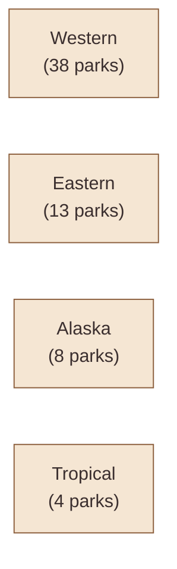

# 🏞️ National Parks

All **63 US national parks**, with a been-there checklist. Open the [[../parks-map/index|interactive map]] to click parks as you visit them.

## How to use this section

- **[[parks|parks.csv]]** — the full list, sortable by state / region / year established
- **[[../parks-map/index|Parks Map]]** — clickable USA map; click a marker to toggle visited
- Ask the **Park Ranger** agent anything: "best park for a 3-day fall trip from Denver", "is The Wave worth the lottery odds", "what's the easiest park I haven't been to from where I live"

## The 63 parks at a glance

## Big-five regional starting points

| If you live near… | Closest must-do park | Sleeper pick |
|---|---|---|
| **NYC / Boston** | Acadia (ME) | Shenandoah (VA) — underrated for fall |
| **DC / Atlanta** | Great Smoky Mountains (TN/NC) | Congaree (SC) — the cypress swamp nobody talks about |
| **Chicago** | Indiana Dunes (IN) for a day; Isle Royale (MI) for an expedition | Cuyahoga Valley (OH) |
| **Denver / Salt Lake** | Rocky Mountain (CO), Arches (UT), Canyonlands (UT) — pick 2 | Great Sand Dunes (CO), Black Canyon of the Gunnison (CO) |
| **LA / SF / Portland / Seattle** | Yosemite, Olympic, Crater Lake — basically pick any direction | Lassen Volcanic (CA), North Cascades (WA), Pinnacles (CA) |
| **Phoenix / Tucson** | Grand Canyon (AZ), Saguaro (AZ) | Petrified Forest (AZ), Guadalupe Mountains (TX) |

## Permit-required parks (apply months ahead)

These need real planning — not just showing up:

- **Half Dome (Yosemite)** — daily lottery if you want the cables; spring lottery for a full permit
- **The Wave (Vermilion Cliffs, technically a national monument adjacent to Grand Canyon NP)** — daily lottery, ~3% odds
- **Angels Landing (Zion)** — seasonal lottery
- **Mt. Whitney summit (Sequoia / Inyo)** — spring lottery
- **Denali road lottery** — fall, for the road-closure week
- **Wonder Lake / backcountry permits at Denali** — book ASAP when reservations open
- **Havasu Falls (adjacent to Grand Canyon)** — sells out in minutes when reservations open

The Park Ranger agent will flag these when they're in your trip plan.

## Logistics by park type

| Park type | What it really takes |
|---|---|
| **Drive-up scenic** (Bryce, Cuyahoga, Indiana Dunes, Hot Springs, Gateway Arch) | A day or two |
| **Standard "big" parks** (Yosemite, Yellowstone, Glacier, Grand Canyon, Zion) | 4-7 days minimum |
| **Hiking-required** (Glacier, Olympic, North Cascades, Sequoia/Kings Canyon, Rocky Mountain) | The park is mostly trails — 3-5 days minimum |
| **Expedition parks** (Isle Royale, Dry Tortugas, Channel Islands, American Samoa, Gates of the Arctic, Kobuk Valley, Lake Clark) | Boats, planes, charters. 5-10 days, $$$$ |
| **Alaska 8** | Fly to Anchorage; multi-day trips per park; $$$ |

## 🌟 Park Spotlight

### 2026-04 — Pinnacles, CA
**Why this month:** Late April is the narrow window where wildflowers are still peaking, California condors are active around the High Peaks, and Bear Gulch Cave is still open before it closes mid-May for the Townsend's big-eared bat maternity colony — by June this park is a furnace.
**Don't miss:** The High Peaks loop (~6.7 mi) — narrow rock-cut steps with handrails through the spires, near-guaranteed condor sightings, and you can route it through Bear Gulch Cave and Reservoir on the way down.
**Logistics:** No permits needed. No lodging inside the park except Pinnacles Campground (East side, reservable). East and West entrances are NOT connected by road — pick one. East from Hollister is more developed; West from Soledad is wilder. 2hr drive from SF, ~3hr from LA.
**Plan:** 1–2 days. Doable as a day trip from the Bay Area, but one night at the campground gets you a sunrise on the High Peaks and a chance at dawn condor flights.

## Past spotlights

_Older monthly spotlights archive here._

## Browse the data

→ [[parks|All 63 parks (CSV)]]
→ [[../parks-map/index|Interactive map]]
